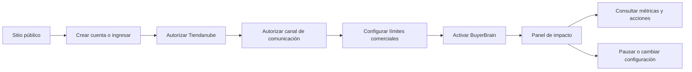
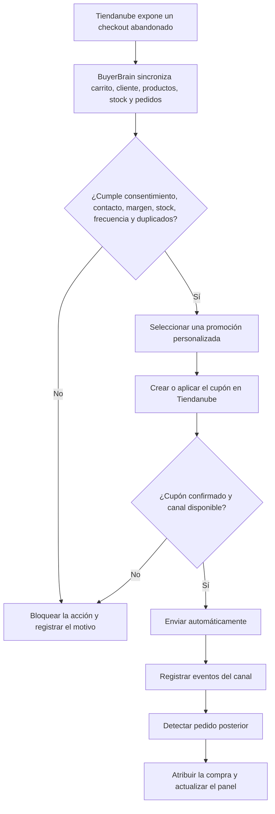

# Flujos vigentes de BuyerBrain

**Actualización:** 20/08/2026

Este documento reemplaza como referencia vigente a los PNG históricos `sipoc-b2b.png` y `proceso-as-is.png`.

## Recorrido del usuario de BuyerBrain

## Automatización de recuperación

## Responsabilidades

| Componente | Responsabilidad |
|---|---|
| Sitio y aplicación | Registro, onboarding, configuración, panel y auditoría |
| Tiendanube | Checkouts, clientes, catálogo, stock, pedidos y cupones autorizados |
| BuyerBrain | Elegibilidad, recomendación, coordinación, atribución y trazabilidad |
| Canal conectado | Envío y eventos disponibles de comunicación |
| Marca | Autorizar conexiones, definir límites y controlar la automatización |

No existe aprobación humana por cada oferta. La marca conserva control previo mediante reglas y control operativo mediante pausa, desconexión e historial.
