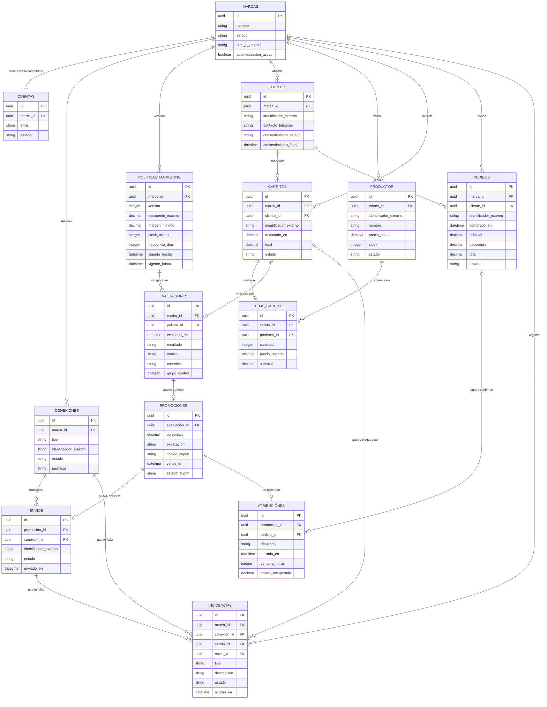

# Clase 10 · Modelo de datos

**Fecha:** 07/09/2026  
**Equipo:** BuyerBrain  
**Integrantes:** Juan Martín Sastre y Pedro Bulgach

## 1. Flujos que el modelo tiene que soportar

| Actor / rol | Acción principal | Qué información crea o modifica | Qué información consulta |
|---|---|---|---|
| Responsable de la marca | Crea o utiliza la cuenta compartida | Datos de la marca y acceso | Estado general de la cuenta |
| Responsable de la marca | Conecta Tiendanube y Telegram | Estado y permisos de las conexiones | Servicios conectados y posibles errores |
| Responsable de la marca | Define políticas y activa, pausa o reanuda BuyerBrain | Límites comerciales y estado de la automatización | Configuración vigente |
| Tiendanube | Informa un carrito abandonado | Datos sincronizados del carrito, productos, cliente y stock | Autorización de la marca |
| BuyerBrain | Evalúa el carrito | Estado de evaluación, resultado y motivo de bloqueo | Carrito, stock, consentimiento, frecuencia, duplicados y políticas |
| BuyerBrain | Genera una promoción y aplica un cupón | Promoción, explicación, cupón y sus estados | Políticas y resultado de la evaluación |
| Telegram | Envía la promoción | Fecha y estado del mensaje | Contacto autorizado y contenido de la promoción |
| Comprador de la tienda | Compra o no compra | Pedido posterior en Tiendanube | Promoción recibida |
| BuyerBrain | Determina si la venta fue recuperada | Estado final, fecha, pedido y monto atribuido | Envío, cupón, pedido y ventana de atribución |
| Responsable de la marca | Consulta el panel y el detalle | No modifica datos de recuperación | Métricas, acciones, bloqueos, ventas y montos |
| Responsable de la marca | Desconecta servicios o elimina sus datos | Conexiones, automatización y ciclo de vida de los datos | Estado y consecuencias de la acción |

## 2. Lo que decidió el equipo

- Una marca utiliza una cuenta compartida para conectar Tiendanube y Telegram, definir sus políticas y controlar BuyerBrain.
- BuyerBrain detecta carritos abandonados, los evalúa, envía una promoción cuando corresponde y registra si recuperó la venta.
- Los estados del recorrido son `detectado → en evaluación → bloqueado` o `detectado → en evaluación → promoción enviada → recuperado / no recuperado`.
- Una marca puede tener muchos carritos y un carrito puede contener varios productos, guardados por separado.
- Una persona compradora puede tener varios carritos a lo largo del tiempo.
- Se guarda el historial de versiones de las políticas para poder explicar decisiones pasadas.
- Una persona no puede recibir otra promoción hasta siete días después del último envío.
- El MVP genera únicamente descuentos porcentuales.

## 3. Decisiones de diseño

- La cuenta es compartida por varias personas de la marca y todas tienen los mismos permisos. Esto simplifica el MVP, pero no permite saber quién realizó un cambio específico.
- Los datos de cada marca se separan para que ninguna pueda consultar información de otra.
- Se conservan los datos necesarios para ejecutar y auditar la recuperación: carrito, productos, contacto de Telegram, consentimiento, evaluación, cupón, fechas, estados, pedido e importes.
- No se guardan identificación fiscal ni domicilio completo. La segmentación geográfica queda para una versión futura.
- El precio de cada producto dentro del carrito se guarda como fue observado en ese momento. Esto no duplica por error el precio actual: conserva evidencia histórica de la decisión.
- Una evaluación apunta a la versión exacta de la política aplicada, aunque después la marca cambie sus límites.
- Si una evaluación queda bloqueada, no genera promoción ni envío.
- La atribución registra tanto una recuperación como el cierre sin recuperación. El pedido sólo existe cuando hubo una compra relacionada.

### Supuestos pendientes

- Validar la autorización técnica de Telegram y cómo se comprueba el consentimiento para contactar.
- Definir el porcentaje recomendado y el descuento máximo permitido.
- Validar la ventana de atribución. La definición vigente propone inicialmente 48 horas.
- Definir cuánto tiempo se conservarán los datos y el procedimiento de eliminación.
- Validar con marcas y compradores el límite inicial de un envío cada siete días.

### Fuera del MVP

- Segmentación geográfica y datos fiscales completos del comprador.
- Cuentas individuales y roles dentro de una marca.
- Canales diferentes de Telegram y plataformas diferentes de Tiendanube.
- Varias promociones para un mismo carrito.
- Paneles avanzados, análisis avanzados y aprendizaje automático avanzado.

## 4. Tablas y campos

| Tabla | Qué representa (en lenguaje cotidiano) | Campos principales | PK | FK / relación |
|---|---|---|---|---|
| `marcas` | La empresa que usa BuyerBrain | nombre, estado, plan_o_prueba, automatización activa, fechas de alta y baja | `id` | — |
| `cuentas` | Las credenciales compartidas de acceso | email, nombre visible, estado, último acceso | `id` | `marca_id` → `marcas` |
| `conexiones` | Cada servicio autorizado | tipo (`tiendanube` o `telegram`), identificador externo, estado, permisos, fechas de conexión y error | `id` | `marca_id` → `marcas` |
| `politicas_marketing` | Una versión de los límites comerciales | versión, descuento porcentual máximo, margen mínimo, stock mínimo, frecuencia de 7 días, vencimiento, exclusiones, vigencia | `id` | `marca_id` → `marcas` |
| `clientes` | Una persona compradora sincronizada desde Tiendanube | identificador externo, contacto de Telegram, estado y fecha del consentimiento, fecha de actualización | `id` | `marca_id` → `marcas` |
| `productos` | Un producto sincronizado | identificador externo, nombre, precio actual, stock y estado | `id` | `marca_id` → `marcas` |
| `carritos` | Un carrito abandonado detectado | identificador externo, fechas de creación y detección, total y estado | `id` | `marca_id` → `marcas`; `cliente_id` → `clientes` |
| `items_carrito` | Un producto concreto dentro de un carrito | cantidad, precio unitario y subtotal observados | `id` | `carrito_id` → `carritos`; `producto_id` → `productos` |
| `evaluaciones` | La revisión automática de un carrito | fecha, resultado, motivo, controles realizados y pertenencia al grupo de control | `id` | `carrito_id` → `carritos`; `politica_id` → `politicas_marketing` |
| `promociones` | La oferta porcentual elegida y su cupón | porcentaje, explicación, código, vencimiento y estado del cupón | `id` | `evaluacion_id` → `evaluaciones` |
| `envios` | El mensaje enviado por Telegram | identificador externo, estado, fecha de envío y última actualización | `id` | `promocion_id` → `promociones`; `conexion_id` → `conexiones` |
| `pedidos` | Una compra posterior informada por Tiendanube | identificador externo, fecha, subtotal, descuento, total y estado | `id` | `marca_id` → `marcas`; `cliente_id` → `clientes` |
| `atribuciones` | El resultado de buscar una compra asociada a la promoción | resultado, fecha de cierre, ventana aplicada y monto recuperado | `id` | `promocion_id` → `promociones`; `pedido_id` → `pedidos` (opcional) |
| `incidencias` | Un error que debe mostrarse o resolverse | tipo, descripción, estado, fecha, resolución y recurso relacionado | `id` | `marca_id` → `marcas`; `conexion_id` → `conexiones`, `carrito_id` → `carritos` o `envio_id` → `envios` (opcionales) |

## 5. Relaciones

- Una marca tiene una cuenta compartida porque en este MVP todas las personas de la empresa usan el mismo acceso.
- Una marca puede tener muchas conexiones porque autoriza, como mínimo, Tiendanube y Telegram.
- Una marca puede tener muchas versiones de sus políticas porque cada cambio debe conservarse para auditoría.
- Una marca puede tener muchos clientes, productos, carritos, pedidos e incidencias.
- Un cliente puede tener muchos carritos y pedidos a lo largo del tiempo. Esto permite aplicar el límite de siete días.
- Un carrito contiene muchos productos mediante `items_carrito`; un producto también puede aparecer en muchos carritos.
- Un carrito puede tener una evaluación y una evaluación utiliza una versión concreta de la política.
- Una evaluación puede no producir ninguna promoción si queda bloqueada; si se aprueba, produce como máximo una.
- Una promoción puede producir un envío y un resultado de atribución.
- Una atribución puede apuntar a un pedido cuando hubo compra; si no la hubo, cierra como no recuperada sin pedido asociado.
- Una incidencia puede señalar la conexión, el carrito o el envío que falló.

## 6. Recorrido de prueba

Ejemplo ficticio: Camila, responsable de la marca Luna Sur, utiliza la cuenta compartida.

1. Camila ingresa. BuyerBrain consulta `cuentas` y `marcas`.
2. Conecta Tiendanube y Telegram. Se crean dos registros en `conexiones`.
3. Define un descuento porcentual máximo y el límite de un envío cada siete días. Se crea una versión en `politicas_marketing`.
4. Sofía abandona un carrito con una remera y un pantalón. BuyerBrain crea o actualiza un registro en `clientes`, crea el `carrito` y agrega dos `items_carrito` relacionados con sus `productos`.
5. BuyerBrain revisa consentimiento, contacto, stock, margen, duplicados y frecuencia. Crea una `evaluacion` vinculada con la política vigente.
6. Como cumple las reglas, crea una `promocion` porcentual y registra el cupón confirmado.
7. Telegram envía el mensaje. Se crea un `envio` con su fecha y estado.
8. Sofía compra dentro de la ventana establecida. Tiendanube informa un `pedido` con subtotal, descuento y total.
9. BuyerBrain crea una `atribucion`, marca el carrito como `recuperado` y muestra el monto en el panel.
10. Si Sofía abandona otro carrito al día siguiente, se crea una nueva evaluación y queda `bloqueado` por la regla de siete días.

El recorrido puede completarse sin aprobación manual, cada dato central tiene un lugar definido y el modelo permite calcular las métricas básicas del negocio.

## 7. Diagrama

